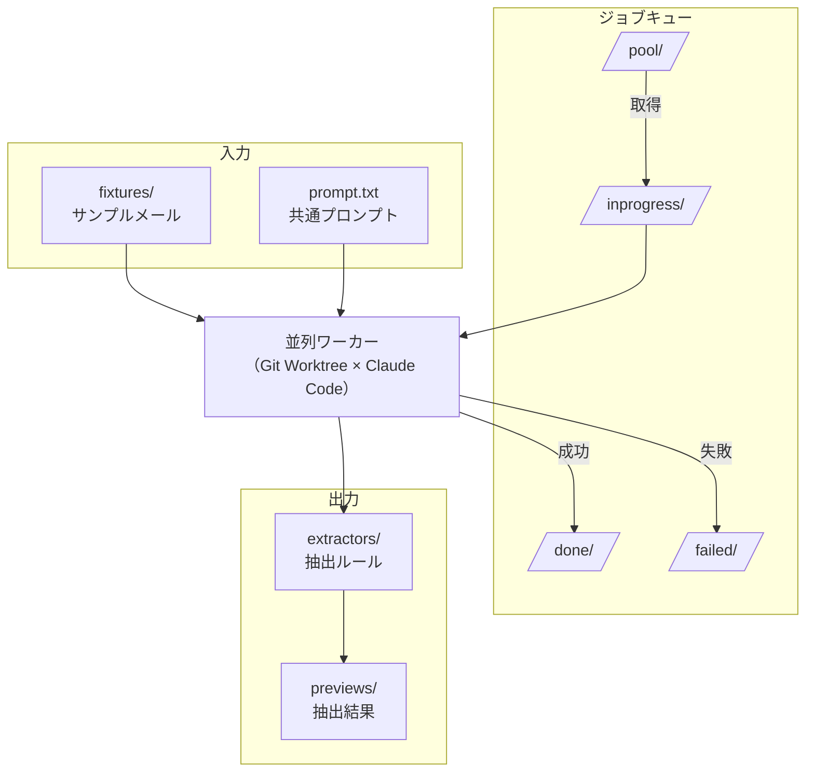

# Git Worktree × Claude Code 並列処理デモ

**試行錯誤しないと正解が出ない**タイプのタスクを AI に大量に任せたいとき、以下の課題に直面します。
- 1つのセッションで50件処理させると品質が落ちる。
- 1件失敗すると全体が止まる。

そこで **1タスク=1セッション** に分離して並列実行し、失敗しても他に影響を与えない仕組みを作ります。

Git Worktree を使ったハンズオン学習により、知識を定着させます。

詳しい背景やGit Worktreeなどについては [Qiita記事](docs/Qiita_Draft.md) を参照してください。

---

## シナリオ (設定)

あなたは [QUBOOK](https://qiita.com/Peanuts05/items/391cc451f678c908f650) という子供向けオリジナル絵本生成サービスを運営しています。
日々届くお問い合わせメールを分析して、よくある質問を FAQ に反映したいと考えています。

しかし、メールには署名や免責事項などのノイズが含まれていて、本文だけを抽出する必要があります。

```
絵本の作成にはどのくらい時間がかかりますか？
子供の誕生日に間に合わせたいのですが、
来週届くか教えていただけますか。

--
山田太郎
A社 営業部
TEL: 03-1234-5678
```

↑ この場合、`--` 以降が署名（ノイズ）です。

問題は、顧客ごとにノイズのパターンが違うことです。
- A社: `--` で始まる署名ブロック
- B社: `Best regards,` + 罫線 + 免責事項
- C社: 引用（`>`）+ 転送ヘッダ
- etc...

手動で全てのメールを確認して、人間がルールを書くのは大変だし、モチベーションも湧かないでしょう。また、大量の顧客を対象にすると、1社ずつ処理するのは時間がかかりすぎてしまいます。そこで、「**Claude Code にルール生成を任せて、並列処理したい**」と考えました。

本ハンズオン教材では、**Git Worktree** を用いて複数の Claude Code を安全に並列実行する仕組みを実際に作って動かします。

今回は **Git Worktree × Claude Code** に焦点を当てているので「受信メールの加工」というそこまで難易度の高いタスクではありませんが、もっと多種類の難易度の高いタスクも可能だと期待しており、今後とも活用していきたいです。
(私は、実際の実務では、上記の技術をcrawl4aiのパラメータ調整に利用しています。)

---

## 全体像



| ステップ | 内容 |
|----------|------|
| 1 | ジョブを `pool/` に投入 |
| 2 | 各ワーカーがジョブを取得 → `inprogress/` に移動 |
| 3 | Claude Code がサンプルメールを読み、抽出ルールを生成 |
| 4 | 結果に応じて `done/` または `failed/` に移動 |

**なぜ Git Worktree？（単に並列セッションではダメなのか）**

同じディレクトリで複数の Claude Code を同時に動かすと以下の問題があります
- Git 操作（add, commit, reset）が衝突し、意図しないファイルがコミットされる
- 失敗時の `git reset --hard` で他のワーカーの作業も消える
- ブランチ切り替えが競合する

一方で、Git Worktree なら以下の利点があります
- 作業ツリー・index・HEAD が**完全に分離**
- 各ワーカーが独立したブランチで作業
- 1つが失敗しても、他のワーカーは影響を受けずに続行

---

## 必要なもの

- Git 2.5+
- Python 3.8+
- Claude Code CLI

---

## Step 0: リポジトリをクローン

```bash
cd ~
git clone https://github.com/peanuts05-6c6e797671xeh7iicsa/claude-code-worktree-demo.git
```

この時点でのディレクトリ構成：

```
~/claude-code-worktree-demo/   # ← クローン後はここに移動
├── scripts/                     # スクリプト
├── fixtures/                    # 入力：顧客ごとのメールの本体
├── queue/                       # ジョブキュー (JSONで管理)
│   ├── pool/                    #   未処理ジョブ
│   ├── inprogress/              #   処理中
│   ├── done/                    #   成功
│   └── failed/                  #   失敗
├── extractors/                  # 出力：抽出ルール（Claude Code が作成）
├── previews/                    # 出力：抽出結果（extract.pyを実行することで生成）
├── prompt.txt                   # Claude Code 用プロンプト
└── README.md
```

ブランチは `main` のみ：

```bash
git branch
# * main
```

---

### 中身を見てみる (事前準備の段階)

**fixtures/** - 顧客ごとのサンプルメール（入力データ）

```bash
cat fixtures/a-corp/mail_001.txt
```
```
絵本の作成にはどのくらい時間がかかりますか？
子供の誕生日に間に合わせたいのですが、
来週届くか教えていただけますか。

--
山田太郎
A社 営業部
TEL: 03-1234-5678
```

署名（`--` 以降）がノイズです。これを除去したい。

---

**queue/** - ジョブキュー（ワーカーがここからジョブを取得）

```bash
ls queue/pool/
# a-corp.json  b-corp.json  c-corp.json ... （50件）
```

最初から50件のジョブが `pool/` に入っています。
ワーカーが処理すると `done/` または `failed/` に移動します。

---

**extractors/** - 抽出ルール（Claude Code が作成）

```bash
ls extractors/
# （最初は .gitkeep のみ）
```

Claude Code がサンプルメールを分析し、顧客ごとの抽出ルールを YAML 形式で作成します。

```yaml
# extractors/a-corp.yaml の例
customer_id: "a-corp"       # 顧客ID（ファイル名と一致）
stop_markers:               # この文字列が出たら、その行以降を全削除
  - "--"
drop_line_regex: []         # 正規表現にマッチする行を個別に削除
```

---

**previews/** - 抽出結果（extract.py が生成）

```bash
ls previews/
# （最初は .gitkeep のみ）
```

`extract.py` が extractor の YAML ルールを適用し、署名などのノイズを除去した本文を出力します。

```
# previews/a-corp.txt の例 (AIでextractors/配下のyamlファイルをFIXしたらこうなっていてほしい)
絵本の作成にはどのくらい時間がかかりますか？
子供の誕生日に間に合わせたいのですが、
来週届くか教えていただけますか。
```

**処理の流れは以下の通りです**
1. ワーカーがジョブを取得
2. Claude Code が `extractors/<customer_id>.yaml` を作成
3. `extract.py` が YAML を読み込み、`previews/<customer_id>.txt` を生成
4. 検証が通れば成功、通らなければリトライ

---

**prompt.txt** - Claude Code に渡すプロンプトテンプレート

```bash
head -15 prompt.txt
```
```
あなたは git worktree 内で動く自動化エージェントです。
顧客ごとのメール本文抽出ルールを作成してください。

# 対象
customer_id: $customer_id
サンプルメール:
  $fixture_paths
抽出コマンド: $extract_command

# タスク
1. サンプルメールを読み、ノイズパターンを特定
2. extractors/$customer_id.yaml を作成
3. 抽出を実行し、結果を確認
4. OKになるまで調整
...
```

ノイズの判定基準や完了条件は共通のガイドラインとしてプロンプト内に記載。
`$customer_id` などはジョブごとに置換されます。

---

## Step 1: Python 環境を準備

```bash
python -m venv .venv
source .venv/bin/activate   # Windows: .venv\Scripts\activate
pip install -r requirements.txt
```

---

## Step 2: 抽出プログラムの仕組みを理解する

ワーカーを動かす前に、抽出プログラムの動作を理解しておきましょう。

> **注意**: ここでは `demo` を使います（Step 4 と衝突を避けるため）

### 現状確認：extractors/ は空

```bash
ls extractors/
# .gitkeep のみ（まだルールがない）
```

### extractor なしで実行するとどうなる？

```bash
python scripts/extract.py demo
cat previews/demo.txt
```

extractor がない状態で実行すると、ノイズが除去されずそのまま出力されます。

### 手動で extractor を作成してみる

`fixtures/demo/mail_001.txt` を見て、署名部分（`--` 以降）を除去するルールを作成します。

`extractors/demo.yaml` を以下の内容で作成してください：

```yaml
customer_id: "demo"
stop_markers:
  - "--"
drop_line_regex: []
```

### 抽出を実行

```bash
python scripts/extract.py demo
cat previews/demo.txt
```

出力：
```
これはデモ用のサンプルメールです。
抽出プログラムの動作確認に使います。
```

署名（`--` 以降）が消えて、本文だけが残りました。

### 問題：これを全顧客分、手動で書くのは非常に大変です。。。

- A社は `--` で署名が始まる
- B社は `Best regards,` + 罫線
- C社は引用（`>`）+ 転送ヘッダ
- ...

顧客ごとにメールを読んで、ルールを考えて、YAML を書いて...これを手動でやるのは骨が折れます。

**→ Step 3 の Git Worktree と Step 4 の Claude Code で自動化させましょう。**

---

## Step 3: Git Worktree を作成

**ここが本教材のポイントです。**

同じリポジトリに対して、別々の作業ディレクトリ（worktree）を3つ作ります。

```bash
# worktree を格納するディレクトリを作成
mkdir -p ../.worktrees

# 3つの worktree を作成
git worktree add ../.worktrees/w0 -b worker-0 main
git worktree add ../.worktrees/w1 -b worker-1 main
git worktree add ../.worktrees/w2 -b worker-2 main
```

確認してみましょう：

```bash
git worktree list
```

出力例：
```
/home/user/claude-code-worktree-demo    abcd123 [main]
/home/user/.worktrees/w0                  abcd123 [worker-0]
/home/user/.worktrees/w1                  abcd123 [worker-1]
/home/user/.worktrees/w2                  abcd123 [worker-2]
```

ブランチも増えています：

```bash
git branch
# * main
#   worker-0
#   worker-1
#   worker-2
```

これで、w0 / w1 / w2 それぞれが独立した作業ディレクトリになりました。
中身は main と同じですが、別々のブランチで作業できます。

---

## Git Worktree 作成後のディレクトリ構成

```
~/
├── claude-code-worktree-demo/   # メインリポジトリ（main ブランチ）
│   ├── scripts/
│   ├── fixtures/
│   ├── queue/              # ジョブキュー
│   │   ├── pool/           #   未処理ジョブ（50件）
│   │   ├── inprogress/     #   処理中（空）
│   │   ├── done/           #   成功（空）
│   │   └── failed/         #   失敗（空）
│   └── ...
└── .worktrees/
    ├── w0/                 # worker-0 ブランチ（中身は main と同じ）
    ├── w1/                 # worker-1 ブランチ
    └── w2/                 # worker-2 ブランチ
```

---

## Step 4: ワーカーを起動

**処理の流れ:**

| 担当 | 処理 |
|------|------|
| worker.py | `pool/` からジョブを取得 → `inprogress/` に移動 |
| worker.py | `job/<customer_id>` ブランチを作成 |
| worker.py | Claude Code を起動 |
| **Claude Code** | サンプルメールを読み、ノイズパターンを特定 |
| **Claude Code** | `extractors/<id>.yaml` を作成 |
| **Claude Code** | `extract.py` を実行して結果を確認 |
| **Claude Code** | OKになるまで調整（PDCA ループ） |
| worker.py | 結果を検証（ファイル存在、空でない） |
| worker.py | 成功なら `git commit`、`done/` に移動 |
| worker.py | 失敗なら `failed/` に移動、`git reset --hard` |

> **ポイント**: 品質チェック（ノイズが消えたか、本文が途切れていないか）は **Claude Code が PDCA で行います**。worker.py は最低限のサニティチェックのみです。

> **共有キューについて**: 各 worktree にも `queue/` がコピーされますが、ワーカー起動時に `~/claude-code-worktree-demo/queue` を引数で指定することで、全ワーカーが同じキューを参照します。

ハンズオンでは仕組みを理解するため手動で起動しますが、**実務では worktree 作成からワーカー起動まで一括で行うスクリプトを用意して自動化します。**

---

それでは実践していきます。3つのターミナルを開いて、それぞれ別の worktree でワーカーを起動します。

> **注意**: パスはリポジトリを clone した場所に依存します。以下は `~` に clone した場合の例です。

**ターミナル 1:**
```bash
cd ~/.worktrees/w0
source ../../claude-code-worktree-demo/.venv/bin/activate
python scripts/worker.py ../../claude-code-worktree-demo/queue prompt.txt
```

**ターミナル 2:**
```bash
cd ~/.worktrees/w1
source ../../claude-code-worktree-demo/.venv/bin/activate
python scripts/worker.py ../../claude-code-worktree-demo/queue prompt.txt
```

**ターミナル 3:**
```bash
cd ~/.worktrees/w2
source ../../claude-code-worktree-demo/.venv/bin/activate
python scripts/worker.py ../../claude-code-worktree-demo/queue prompt.txt
```

各ワーカーは pool/ からジョブを取り合い、処理が終わると done/ または failed/ に移動します。

---

## Step 5: 結果を確認する

ワーカーの処理が完了したら、結果を確認しましょう。

> **各 worktree は独立しています**
> - `queue/` は共有（全ワーカーが同じ done/failed/ を参照）
> - `extractors/`, `previews/` は各 worktree に独立して存在
>
> 例: w0 が a-corp, d-corp を処理した場合、`~/.worktrees/w0/extractors/` には a-corp.yaml, d-corp.yaml だけが入っています。

### ジョブの状態（共有）

```bash
ls ~/claude-code-worktree-demo/queue/done/
# a-corp.json  b-corp.json  c-corp.json ...
```

処理したジョブが `done/` に移動していれば成功です。

### 生成されたファイル（各 worktree 内）

```bash
cd ~/.worktrees/w0
ls extractors/
# a-corp.yaml  d-corp.yaml  （w0 が処理した分だけ）

ls previews/
# a-corp.txt  d-corp.txt
```

Claude Code が各顧客の extractor を自動生成し、抽出結果も作成されました。

### 抽出結果の中身

```bash
cat ~/.worktrees/w0/previews/a-corp.txt
```
```
絵本の作成にはどのくらい時間がかかりますか？
子供の誕生日に間に合わせたいのですが、
来週届くか教えていただけますか。
```

署名が除去され、本文だけが抽出されています。

---

## Step 6: ブランチとコミットを確認

各 worktree で作成されたブランチとコミットを確認します。

```bash
cd ~/.worktrees/w0
git branch
# * main
#   job/a-corp
#   job/d-corp
```

成功したジョブごとに `job/<customer_id>` ブランチが作成され、コミットされています。

```bash
git log job/a-corp --oneline -2
# abc1234 Add extractor for a-corp
# def5678 Initial commit
```

---

## Step 7: PR を作成してレビュー (運用次第では必要)

各ブランチをリモートにプッシュして PR を作成します。

```bash
cd ~/.worktrees/w0
git push origin job/a-corp
# GitHub で PR を作成
```

**レビューのポイント:**

PR では `extractors/<id>.yaml` の設定ではなく、`previews/<id>.txt` の結果を確認します。

```
# previews/a-corp.txt
絵本の作成にはどのくらい時間がかかりますか？
子供の誕生日に間に合わせたいのですが、
来週届くか教えていただけますか。
```

- 署名が消えているか？
- 本文が途中で切れていないか？
- 不要な行が残っていないか？

上記は例えば、各顧客担当に PR の URL を送って確認してもらい、結果が OK ならマージするといった運用をとることで、「Human-in-the-Loop」を実現することができます。また、このチェックの際に、人間が設定ファイルの中身を理解する必要はありません。

---

## 後片付け

ハンズオン終了後、または最初からやり直したい場合は、以下を実行してください。

```bash
cd ~/claude-code-worktree-demo

# 1. worktree を確認・削除
git worktree list
# メインリポジトリ以外の worktree があれば削除:
# git worktree remove <パス>

# 2. 全てのブランチを削除（main 以外）
git branch | grep -v '^\* main$' | grep -v '^  main$' | xargs git branch -D 2>/dev/null

# 3. ジョブキューをリセット（全て pool/ に戻す）
mv queue/done/*.json queue/pool/ 2>/dev/null
mv queue/failed/*.json queue/pool/ 2>/dev/null
mv queue/inprogress/*.json queue/pool/ 2>/dev/null

# 4. 生成されたファイルを削除
rm -f extractors/*.yaml
rm -f previews/*.txt

# 5. 確認
git worktree list        # メインリポジトリのみ
git branch               # main のみ
ls queue/pool/ | wc -l   # 50件あればOK
ls extractors/           # .gitkeep のみ
ls previews/             # .gitkeep のみ
```

これで Step 1 から再開できます。
