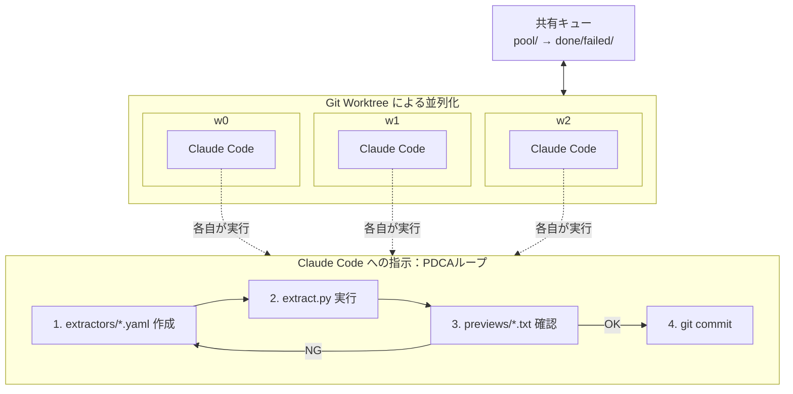

# はじめに

**Git Worktree** を用いたClaude Codeの並列処理を実施したので、年末の時間を活用して、内容を簡略化した教材を作成しました。

本記事では「**AIに大量の同型タスクを並列で処理させつつ、失敗しても他に影響を与えない仕組み**」を紹介します。

## この記事でわかること
- 「**試行錯誤しないと正解が出ない**」タイプの大量タスクをAIに任せる方法
- 1件失敗しても他のタスクに影響を与えない並列処理の設計
- 人間は「設定」ではなく「結果」だけをレビューすればよい仕組み

**リポジトリ**: [GitHub - claude-code-worktree-demo](https://github.com/peanuts05-6c6e797671xeh7iicsa/claude-code-worktree-demo)
（コードの詳細はリポジトリを参照してください）

---

# 課題：AIに大量タスクを任せると何が起きるか

大量のタスクを実施してもらうために Claude CodeやCursor、GeminiCLI, Codex などを使っていて、以下のような経験はないでしょうか。

## 長いセッションで品質が落ちる

同じ形式の変更を50件、100件と処理させたい場面があります。AIは最初の数件は丁寧にやってくれるのですが、セッションが長くなると判断がブレてきたり、さっき伝えた前提を忘れたりします。処理がすべて完了しました！という報告を受けて確認してみると「あれ、指示と違うことをやってない？」となりがちです。

## 1つの失敗が全体に響く

直列で処理していると、途中の1件で失敗したときにセッション全体を巻き戻すのが難しくなります。複数のAIを同時に走らせようとすると、同じファイルを同時に触って壊れる可能性もあります。

---

# 解決策：AIには1タスクだけ任せる

シンプルですが、自然な解決策です。

## タスクを分離して並列に回す

50件を1セッションで処理するから品質が落ちるなら、**1タスク=1セッション**にして、それを並列で回せばいいという考えです。各タスクは独立した作業空間で動かすことで、1件失敗しても他に影響させない設計をとります。

これを実現するのが **Git Worktree** です。同じリポジトリに複数の作業ディレクトリをぶら下げられるので、複数のワーカーが同時に別々のタスクを処理できます。

各ワーカーは独立したブランチで作業するので、暴走しても `git reset --hard` で即座に戻せます。他のワーカーには一切影響しません。

## AIに PDCA を回させる

もう一つ大事で前提にあるのは、**AIに試行錯誤させる** ことです。「作成 → 実行 → 確認 → 調整」のPDCAを Claude Code 自身に回させます。AIがPDCAを回しやすい設計をするかが重要になります。

---

# **Git Worktree** とは

## 従来の使い方

**Git Worktree** は 1つのリポジトリに複数の作業ディレクトリ（working tree）をぶら下げられる機能です（Git 2.5〜）。

典型的なユースケースを考えてみましょう。いま feature ブランチで開発をしているとします。そこへ急に hotfix を入れる必要が出てきました。ブランチを切り替えたいのですが、作業ツリーには編集中のファイルが残っていて、切り替えると作業内容が混ざってしまいそうで不安です。

**従来の対処（stash）**
```bash
git stash           # 退避
git checkout hotfix # 切替
# 修正...
git stash pop       # 復元
```

stash は便利ですが、**戻し忘れ／衝突／何を退避したか分からない** などの面倒がつきまといます。

**Git Worktree を使う場合**
```bash
git worktree add ../hotfix-dir hotfix
# hotfix-dir で修正
git worktree remove ../hotfix-dir
```

feature はそのまま開きっぱなし。終わったら worktree を消すだけです。

つまり **Git Worktree** は元々「**切り替えのストレスを消す道具**」でした。

## AI並列処理での使いどころ

この worktree を AI の並列処理に使うと、以下のような仕組みが成り立ちます。 (3並列の例)

- **w0, w1, w2** の3つの作業場を作る
- それぞれが独立したブランチで完了条件を与えられ、それなりに複雑なタスク作業ができる (**PDCAを回せる**)
- 1つが失敗しても、他の2つは影響を受けずに続行
- 作業ツリー・index・HEADが分離されているので、複数のAIが同時に動いても衝突しない

**作成例（3並列）:**
```bash
mkdir -p ../.worktrees
git worktree add ../.worktrees/w0 -b worker-0 main
git worktree add ../.worktrees/w1 -b worker-1 main
git worktree add ../.worktrees/w2 -b worker-2 main
```

これで `../.worktrees/w0`, `w1`, `w2` の3つの作業場ができます。それぞれ独立した作業ツリーを持ち、同時に別々のブランチで作業できます。

一点だけ注意があって、**Git Worktree** が分離するのはあくまでGitの状態です。Claude Code自体が使う設定ファイル（`~/.claude.json` など）は共有されたままなので、Windows環境だと同時起動でロック競合が起きることがあります（後述のコラム参照）。

### ただ Claude を並列で実行するだけじゃダメなのか？

「並列にしたいなら、Claude を複数セッション立ち上げれば良いのでは？」という疑問はもっともです。テキストを生成するだけ（観点出し・要約など）なら、それで十分です。

ただ本記事で想定しているタスクでは、

1. リポジトリに変更を入れる（設定ファイルを書き換える）
2. プログラムを実行して結果を判定する
3. ダメなら修正してやり直す（最終的に諦めたら `git reset` でクリーンに戻す）

ことを、大量に回すことを想定しています。

このタイプは「失敗したタスクだけ戻す」「途中状態が他と混ざらない」が成功条件なので、作業場（作業ツリー）を分離できる Git Worktree が有効です。

---

# ハンズオン：メール本文抽出ルールの自動生成

**リポジトリ**: [GitHub - claude-code-worktree-demo](https://github.com/peanuts05-6c6e797671xeh7iicsa/claude-code-worktree-demo)

実際にどう動くのか、具体例で見ていきます。環境構築の手順はGitHubリポジトリのREADMEにまとめてあります。

## シナリオ：顧客メールの本文抽出

問い合わせ管理システムを運用しているとします。顧客からメールが届いたら、本文だけを抽出してチケットに登録したいという自然なシナリオです。署名や免責事項が残っていると、担当者が読むときに邪魔ですし、感情分析やカテゴリ分類などの自動処理にも悪影響が出ます。

ただ、困ったことに顧客ごとにノイズのパターンが違います。

**A社のメール例**
```
絵本の作成にはどのくらい時間がかかりますか？
子供の誕生日に間に合わせたいのですが、
来週届くか教えていただけますか。

--
山田太郎
A社 営業部
TEL: 03-1234-5678
```

**B社のメール例**
```
子供の名前の漢字に特別な意味を込めたいのですが、
物語にどう反映されますか？
カスタマイズの範囲を教えてください。

Best regards,
Tanaka
━━━━━━━━━━━━━━━━━━
本メールは送信専用です
配信停止はこちら: https://example.com/unsubscribe
```

A社は `--` で署名が始まりますが、B社は `Best regards,` で始まって、さらに罫線と免責事項まで付いています。つまり、顧客ごとに「どこからがノイズか」を判定する抽出ルールを作る必要があります。

## モチベーション：50社分のルールをどうやって作るか

顧客が5社程度ならまだしも、50社いたら話が変わってくるでしょう。

手作業で1社ずつルールを書くのは現実的ではありません。かといってAIに「50社分のルールを作って」とまとめて頼むと、最初の数社は丁寧にやってくれますが、途中からパターンを使い回したり、細部を見落としたりします。

1社ごとに別セッションでやれば品質は保てますが、50回繰り返すのは非効率です。

## システム構成

そこで、以下のような構成でシステムを組みました。



- **共有キュー**: 全ワーカーが同じ1つの `queue/` を参照します（本体リポジトリの `queue/` を正として、各ワーカーにはその絶対パスを渡します）。ジョブ取得は `pool/` → `inprogress/` へのリネーム（原子的操作）で競合を防ぎます
- **Git Worktree**: w0, w1, w2 の独立した作業空間を提供。互いに干渉しない
- **PDCA ループ**: 各 Claude Code が「yaml作成 → 実行 → 確認 → 調整」を繰り返す

**ディレクトリ構成**

```
~/
├── claude-code-worktree-demo/   # 本体リポジトリ（main ブランチ）
│   ├── scripts/
│   ├── fixtures/
│   ├── queue/               # ジョブキュー
│   │   ├── pool/            #   未処理ジョブ
│   │   ├── inprogress/      #   処理中
│   │   ├── done/            #   成功
│   │   └── failed/          #   失敗
│   ├── extractors/
│   └── previews/
└── .worktrees/
    ├── w0/                  # ワーカー0の作業場
    ├── w1/                  # ワーカー1の作業場
    └── w2/                  # ワーカー2の作業場
```

| ディレクトリ | 中身 | 編集者 |
|-------------|------|--------|
| `extractors/<customer>.yaml` | 顧客ごとの抽出ルール | Claude Code |
| `fixtures/<customer>/` | サンプルメール（入力） | 人間（事前準備） |
| `previews/<customer>.txt` | 抽出結果（出力） | Python（生成のみ） |

**extractor の例**
```yaml
# extractors/a-corp.yaml
customer_id: "a-corp"
stop_markers:
  - "--"           # この文字列以降を削除
drop_line_regex:
  - "^https?://"   # URLだけの行を削除
```

Claude Code が `extractors/*.yaml` にルールを書くと、`extract.py` がそのルール（stop_markers で指定した文字列以降を削除、drop_line_regex にマッチする行を削除）を `fixtures/` のメールに適用し、ノイズを除去した本文を `previews/*.txt` に出力します。

ポイントは責務を分けることです。Claude Codeが触っていいのは `extractors/*.yaml` だけ。人間がレビューするのは抽出したcleanな本文が想定される `previews/*.txt`（結果）だけ。

なお、この教材では理解しやすさを優先して、各ジョブは `extractors/<customer>.yaml` と `previews/<customer>.txt` の **新規追加** だけを扱っています。

## 処理の流れ（具体例付き）

**1. ジョブの投入**

50社分のジョブファイルを `pool/` に投入します。

```
pool/
├── a-corp.json    # A社: 署名が「--」で始まる
├── b-corp.json    # B社: 「Best regards」と免責事項あり
├── c-corp.json    # C社: フッターにURLが複数
└── ... (50社分)
```

各ジョブには顧客IDが記載されています。完了条件は共通のプロンプトテンプレート（prompt.txt）で定義されています。


各Jobに対応するメールの本文は、fixtures/配下に準備しています。


**2. ワーカーの起動**

3つのworktree（w0, w1, w2）でワーカーを起動します。w0/w1/w2 は「作業場」として固定で、ブランチはジョブごとに `job/<customer_id>` を作成します。

それぞれ独立した作業空間なので、互いに干渉しません。


**3. ジョブの奪い合い**

w0, w1, w2 が同時に `pool/` を見に行きます。

- w0 が `a-corp.json` を取得 → `inprogress/` に移動 → `job/a-corp` ブランチを作成
- w1 が `b-corp.json` を取得 → `inprogress/` に移動 → `job/b-corp` ブランチを作成
- w2 が `c-corp.json` を取得 → `inprogress/` に移動 → `job/c-corp` ブランチを作成

`pool/` → `inprogress/` への移動は、同一ボリューム内のリネームとして扱えるため、二重取得を防げます。移動に失敗したら他のワーカーが先に取ったとして次のジョブを探します。


**4. Claude Codeによる調整ループ（A社の例）**

w0 がA社のジョブを処理する様子を見てみましょう。

まず、Claude Codeには以下のようなプロンプトを渡します（要点のみ抜粋）

```
あなたは git worktree 内で動く自動化エージェントです。
顧客ごとのメール本文抽出ルール（extractor）を調整し、
抽出結果が完了条件を満たすまで「調整→実行→判定」を繰り返してください。

# 対象ジョブ
customer_id: a-corp

# 入力
- サンプルメール: fixtures/a-corp/mail_001.txt
- 抽出コマンド: python scripts/extract.py a-corp
- 完了条件:
  1) 本文として自然で、途中で切れていない
  2) 署名・免責・配信停止などが残っていない
  3) 非空行が1行以上ある

# 成果物
- 編集してよいファイル: extractors/a-corp.yaml のみ
- 生成物（編集禁止）: previews/a-corp.txt

# 作業ループ（PDCA）
[1] extractors/a-corp.yaml を作成/更新
[2] python scripts/extract.py a-corp を実行
[3] previews/a-corp.txt を見て判定 → FAIL なら [1] へ戻る
[4] PASS したら完了
```

このプロンプトに従って、Claude Codeは以下のように動きます。

**1回目の試行**
- サンプルメールを読み、「署名は `--` で始まる」と判断
- `stop_markers: ["---"]` を設定したYAMLを作成（`---` と `--` を間違える）
- 抽出プログラムを実行 → 結果を確認
- 署名がそのまま残っている → NG

**2回目の試行**
- 「`---` ではなく `--` だった」と気づく
- `stop_markers: ["--"]` に修正して再実行
- 本文だけが残る → OK → 完了


こんな感じで「設定→実行→判定→再調整」を繰り返して、うまくいくまで回します。AIが自分で試行錯誤するので、人間はプロンプトを書くだけ。失敗しても `git reset --hard` で簡単に巻き戻せます。

本記事では技術デモとして、**完了条件の判定もClaude Codeに任せています**。実運用では、禁止語チェック・必須アンカーの存在確認・最小文字数など、機械的なバリデーションを併用して判定のブレを抑えることが多いと思います。

**5. 完了処理**

- A社のジョブが成功 → `done/a-corp.json` に移動
- w0 は `job/a-corp` ブランチで `extractors/a-corp.yaml` と `previews/a-corp.txt` をコミットし、PRを作成（`previews/*` は `extract.py` が生成した結果で、AIが手編集するものではありません）
- w0 は `main` に戻り、次のジョブ（D社）を `pool/` から取得 → `job/d-corp` ブランチを作成して処理を続行

もしC社のジョブが5回リトライしても失敗した場合
1. `git reset --hard` で作業ツリーを戻す
2. `git clean -fd` で生成物を掃除（※必ず該当worktree内で実行。心配なら `git clean -fdn` でdry-run確認）
3. `main` に戻り、ジョブを `failed/c-corp.json` に移動
4. 後から原因を調べて `pool/` に再投入できる

この「失敗時の儀式」が決まっているため、失敗しても他のworktreeに影響せず、すぐに次のジョブに移れます。


**6. 人間のレビュー**

本記事では単純化のため、**1顧客=1PR** としています（顧客担当が正常性を確認して、マージする想定です。実運用ではworkerブランチにコミットを積み、一定単位でまとめてPRにすることもあります）。

PRには抽出結果（`previews/a-corp.txt`）も含めておきます。人間がレビューするのはYAMLの設定ではなく、この結果のほうがわかりやすいからです。

```
絵本の作成にはどのくらい時間がかかりますか？
子供の誕生日に間に合わせたいのですが、
来週届くか教えていただけますか。
```

レビュアーはこの結果を見て「署名が消えているか」「本文が欠けていないか」を確認します。OKならマージです。

AIがやるのは「設定→実行→判定→再調整」のループの処理で、人間がやるのは、PRに含まれる抽出結果を見て「これでOK」と判断するだけです。設定ファイルの中身を理解する必要はありません。

この Human-in-the-Loop の仕組みをとれば、安定した運用が可能になるでしょう。

---

> **コラム：Windows環境での注意点**
>
> Claude Codeを複数同時に立ち上げると、以下のエラーが発生することがあります：
> ```
> Error: EBUSY: resource busy or locked, open 'C:\Users\xxx\.claude.json'
> ```
> これは `~/.claude.json` への同時アクセスでWindowsのファイルロックが競合するためです。
>
> **対策（確実な順）**：
> 1. 同一ユーザーでの同時起動を避ける（最も確実）
> 2. ユーザーを分ける / コンテナを分ける（ホームディレクトリごと分離）
> 3. `CLAUDE_CONFIG_DIR` 環境変数で分離できる場合がある（ただし挙動はバージョン依存なので、動作確認推奨）

---

# まとめ

やっていることはシンプルで、**Git Worktree** でタスクごとに作業場を分離して、AIにPDCA を回させるだけです。これで「1件失敗しても他に影響しない」「何を変えたか Git で追跡できる」という状態が作れます。

今回は簡略化のためメール抽出ルールを題材にしましたが、実務では「クリーンな情報を crawl4ai で収集するためのパラメータ調整」に利用しています。

他にも、「1発で正解が出ないけど、試行錯誤すれば収束する」タイプのタスクなら横展開可能で、そういうタスクは世の中にあふれていることでしょう。

上記のような、大量の難易度がそこそこのルーティン作業をAIに任せるためにGit Worktreeは欠かせない技術です。今後とも利用してより良い使い方を発掘していきます。

---
